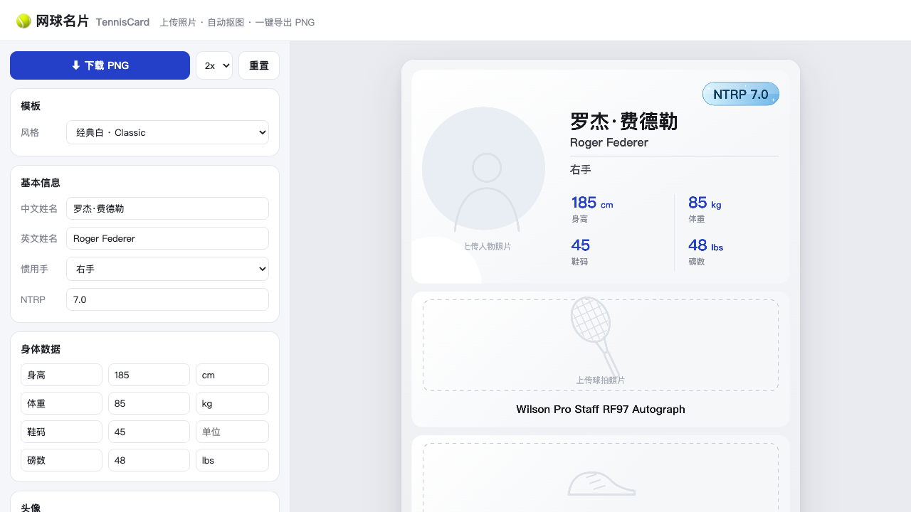
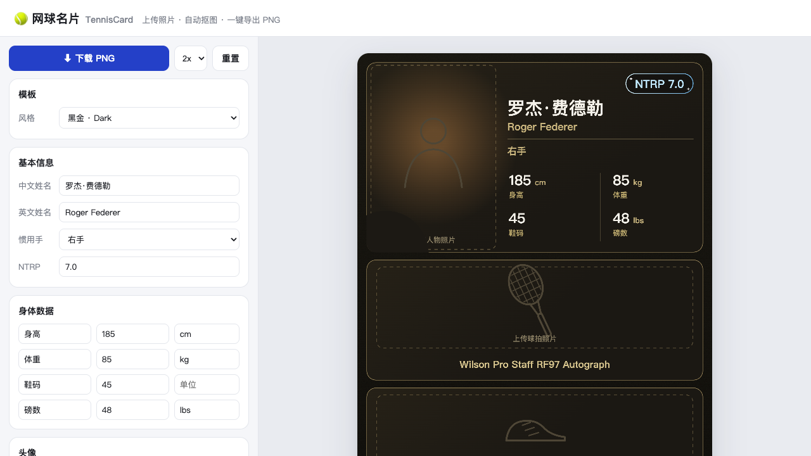

# 🎾 网球名片 TennisCard

> 自定义网球球员卡片生成器 —— 上传照片、自动抠图、双模板风格、一键导出 PNG。
>
> A tennis player card generator — upload photos, auto background removal, dual templates, one-click PNG export.

**在线体验 / Live Demo：<https://tenniscard.vercel.app>**

| 经典白 · Classic | 黑金 · Dark |
|---|---|
|  |  |

## ✨ 功能

- **双模板**：经典白（白底金标蓝色数据）/ 黑金（深炭底 + 香槟金 + 暖橙光晕 + 颗粒质感），同一份数据一键切换
- **人物信息**：头像（自动抠图）、中/英文姓名、惯用手、NTRP 等级徽章、身高/体重/鞋码/磅数（2×2 数据格）
- **NTRP 段位徽章**：按等级变换效果 —— 1.x 白 / 2.x 青铜 / 3.x 白银 / 4.x 黄金 / 5.0+ 钻石（小数归下一层级，如 2.7 → 青铜）
- **装备卡片**：球拍 / 球鞋 / 网球线 / 手胶，上传照片自动抠图，底部名称文字可改
- **三种抠图模式**：
  - `自动去底`（默认）：纯本地算法（边缘泛洪 + 容差/羽化可调 + 去色晕），无需联网
  - `AI 智能抠图`：浏览器内运行语义分割模型（@imgly/background-removal，首次约下载 40MB）
  - `保留原图`
- **精细调节**：每张图支持 缩放 / 旋转 / 上下位置，滑杆与数字输入框双向同步（可直接键入精确值）
- **导出**：1x / 2x / 3x PNG（2x 即 1940×3240）
- **自动保存**：内容（含图片）存 localStorage，刷新不丢

## 🚀 运行

纯静态站点，无构建、无依赖：

```bash
# 方式一：本地静态服务
python3 -m http.server 8765   # 打开 http://localhost:8765

# 方式二：直接双击 index.html（AI 抠图不可用，其余功能正常）
```

> 💡 白色球鞋拍在白底上时本地去底容易误伤，把「容差」调小，或改用 AI 智能抠图。

## 📁 目录结构

```
index.html               页面骨架（左编辑器 / 右预览）
css/style.css            编辑器样式
js/matting.js            抠图引擎（本地算法 + AI 动态加载）
js/templates/registry.js 模板注册表
js/templates/shared.js   模板公共绘制库（几何/文字/图片/占位图/NTRP 段位）
js/templates/classic.js  模板一：经典白
js/templates/dark.js     模板二：黑金
js/app.js                状态管理 / 编辑联动 / 导出 / 持久化
```

## 🧩 扩展新模板

新建 `js/templates/xxx.js`（布局工具直接用 `CardShared`），在 `index.html` 引入即可自动出现在下拉框：

```js
TemplateRegistry.register({
  id: 'neon', name: '霓虹 · Neon',
  width: 970, height: 1620,
  render(ctx, data) { /* 用 Canvas 2D API 绘制整张卡片 */ },
});
```

`data` 字段约定见 `js/app.js` 顶部 `defaultState()`：
基本信息 `name/nameEn/hand/ntrp`；身体数据 `height/weight/shoe/tension = {label, value, unit}`；
图片区 `avatar/racket/shoes/strings/grip = {img, scale, rot, dy, label}`。

## 📄 License

[MIT](LICENSE) © alfreddiao
